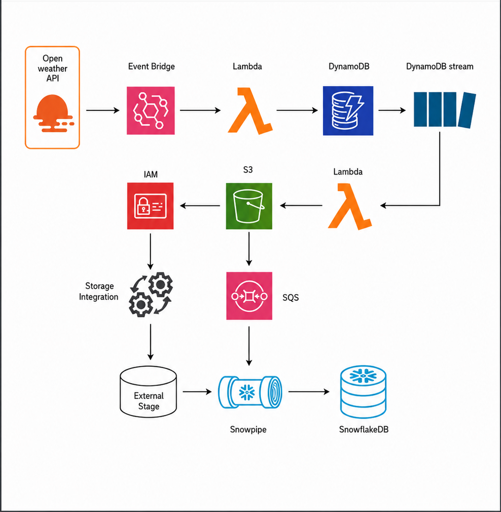

# Weather Data Pipeline

A fully automated cloud-based weather data pipeline built using AWS and Snowflake.

This project fetches live weather data from the OpenWeatherMap API every hour, stores the latest weather data in DynamoDB, uploads transformed JSON data into Amazon S3, and automatically refreshes data in Snowflake for analytics.

---

# Architecture



---


## AWS Services
- AWS Lambda
- Amazon DynamoDB
- Amazon S3
- Amazon EventBridge
- IAM Roles & Policies

## Data Warehouse
- Snowflake

## Programming Languages
- Python
- SQL

---

# Project Workflow

```text
EventBridge (1 hour scheduler)
↓
Lambda 1 → Fetch weather data from OpenWeatherMap API
↓
DynamoDB → Store latest city weather
↓
DynamoDB Stream
↓
Lambda 2 → Read latest records and upload JSON to S3
↓
Amazon S3 → Store latest weather JSON file
↓
Snowflake → Load and refresh weather analytics table
```

---

# Features

- Fully automated hourly weather collection
- Real-time cloud data pipeline
- Latest weather overwrite logic
- DynamoDB stream-based event processing
- JSON transformation pipeline
- Snowflake integration with S3 external stage
- Automated Snowflake refresh task
- Scalable serverless architecture

---

# Folder Structure

```text
WEATHERAPI/
│
├── assets/
│   └── weather-pipeline.png
│
├── lambda/
│   ├── weather_to_dynamodb.py
│   └── dynamodb_to_s3.py
│
├── snowflake/
│   └── pipeline.sql
│
├── .gitignore
└── README.md
```

---

# AWS Architecture Components

## 1. EventBridge
Triggers Lambda 1 every 1 hour automatically.

## 2. Lambda 1
Fetches live weather data from OpenWeatherMap API and stores latest city weather data in DynamoDB.

## 3. DynamoDB
Stores latest weather records using:
- Partition Key: `city`

This ensures only the latest weather record exists for each city.

## 4. DynamoDB Stream
Detects table updates and triggers Lambda 2 automatically.

## 5. Lambda 2
Scans DynamoDB table and uploads the latest dataset into Amazon S3 as a JSON array.

## 6. Amazon S3
Stores the latest weather dataset file:

```text
all_cities_weather.json
```

## 7. Snowflake
Reads weather data directly from S3 using:
- Storage Integration
- External Stage
- Automated Tasks

---

# Sample JSON Output

```json
[
  {
    "city": "Kochi",
    "timestamp": "2026-05-15T10:00:00",
    "temperature": 33.2,
    "humidity": 70
  },
  {
    "city": "Mumbai",
    "timestamp": "2026-05-15T10:00:00",
    "temperature": 32.8,
    "humidity": 66
  }
]
```

---

# Lambda 1 Responsibilities

File:

```text
lambda/weather_to_dynamodb.py
```

Responsibilities:
- Call OpenWeatherMap API
- Fetch weather data for cities
- Transform response
- Upload latest records to DynamoDB

---

# Lambda 2 Responsibilities

File:

```text
lambda/dynamodb_to_s3.py
```

Responsibilities:
- Scan DynamoDB table
- Convert records into JSON array
- Upload latest dataset to Amazon S3
- Overwrite old S3 file

---

# Snowflake Responsibilities

File:

```text
snowflake/pipeline.sql
```

Responsibilities:
- Create database and schema
- Configure S3 storage integration
- Create external stage
- Create analytics table
- Refresh latest weather data automatically

---

# Snowflake Automation

Snowflake Task automatically:
1. Deletes old rows
2. Loads latest JSON data from S3
3. Refreshes weather analytics table every hour

---

# Security Notes

- API keys should NOT be hardcoded in production
- Use AWS Secrets Manager or Lambda Environment Variables
- IAM permissions should follow least privilege principle

---

# Future Improvements

- Add historical weather tracking
- Create Power BI/Tableau dashboards
- Use Snowpipe auto ingestion
- Add Terraform infrastructure automation
- Add CI/CD pipeline
- Add real-time streaming with Kinesis
- Deploy analytics dashboard

---

# Learning Outcomes

This project demonstrates:
- Serverless cloud architecture
- Event-driven pipelines
- Data engineering fundamentals
- AWS service integration
- Snowflake external staging
- JSON transformation workflows
- Automated ELT pipeline design

---

# Author

Ashwin CV

Cloud & Data Engineering Project